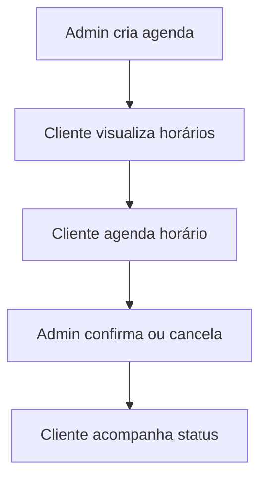

# 🚗 Sistema de Agendamento de Lava Jato


---

## 📌 Sobre o Projeto

Sistema web desenvolvido para **agendamento de serviços automotivos**, com duas áreas:

* 👤 **Cliente** → agenda horários e acompanha serviços
* 🧑‍💼 **Administrador** → define disponibilidade e gerencia agendamentos

> Projeto focado em prática de **React, lógica de negócio e integração com API**

---

## 🖼️ Preview

### 🏠 Página Inicial


### 🔐 Login


### 👤 Dashboard do Cliente


### 🧑‍💼 Painel do Admin


> 💡 Crie uma pasta `screenshots` no projeto e coloque prints das telas

---

## 🚀 Funcionalidades

### 👤 Cliente

* Selecionar data
* Visualizar horários disponíveis
* Agendar lavagem
* Cancelar agendamento
* Ver histórico de serviços

### 🧑‍💼 Administrador

* Criar agenda por data
* Definir horários disponíveis
* Gerar horários automáticos (9h às 18h)
* Confirmar agendamentos
* Excluir agendamentos (liberar horário)

---

## 🔄 Fluxo do Sistema



---

## 🛠️ Tecnologias

* ⚛️ React (Vite)
* 🎨 Tailwind CSS
* 🔀 React Router DOM
* 🌐 Axios (preparado)
* 💾 LocalStorage (mock)

---

## 📁 Estrutura

```bash
src/
│
├── components/
├── pages/
├── services/
├── App.jsx
└── main.jsx
```

---

## 🔐 Autenticação (Mock)

Atualmente simulada:

* Emails com **"admin"** → acesso admin
* Outros → cliente

```js
if (email.includes("admin")) {
  tipo = "admin";
} else {
  tipo = "cliente";
}
```

---

## 💾 Persistência de Dados

* `agenda` → horários disponíveis
* `agendamentos` → reservas
* `user` → usuário logado

---

## 🔌 Integração com Backend

Projeto preparado para API real com Axios:

```js
const USE_MOCK = true;
```

👉 Quando tiver backend:

```js
const USE_MOCK = false;
```

---

## ▶️ Como Rodar o Projeto

```bash
# Clonar repositório
git clone https://github.com/seu-usuario/seu-repo.git

# Entrar na pasta
cd seu-repo

# Instalar dependências
npm install

# Rodar projeto
npm run dev
```

---

## 🌍 Deploy

Pode ser hospedado em:

* Netlify
* Vercel

---

## ⚠️ Problemas Resolvidos

* ✅ Bug de login (refresh)
* ✅ Controle de agendamentos
* ✅ Sincronização admin/cliente
* ✅ Estrutura pronta para backend

---

## 📈 Melhorias Futuras

* 🔐 Autenticação real (JWT)
* 🛡️ Proteção de rotas
* 📡 Backend com Node.js
* 🔔 Notificações (toast)
* 📊 Dashboard com métricas
* 📱 Melhor responsividade

---

## 👨‍💻 Autor

Desenvolvido por **Anderson de Souza**

---

## ⭐ Contribuição

Se gostou do projeto:

⭐ Deixe uma estrela
🐛 Reporte bugs
💡 Sugira melhorias

---

## 📜 Licença

Este projeto está sob a licença MIT.
